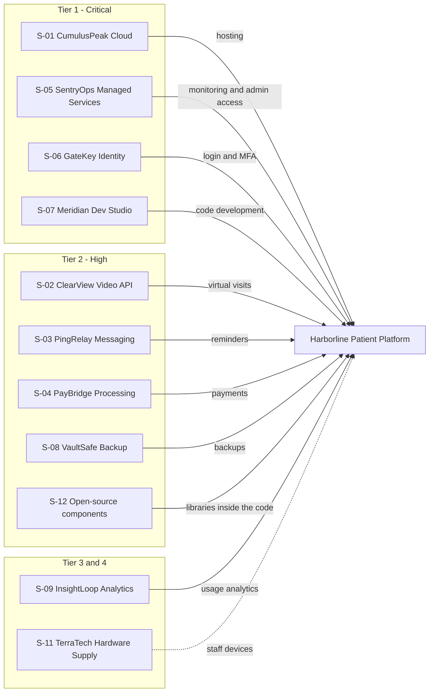

## 4.1 Supplier Inventory

Harborline's supplier inventory contains 12 suppliers. Eleven support the patient platform and are assessed in this report. One, PayrollPoint HR, is excluded because it handles employee data only and does not support the platform.

| ID | Supplier | Type | Services provided | Data or access held | Status |
|---|---|---|---|---|---|
| S-01 | CumulusPeak Cloud | Cloud hosting | Servers, databases, storage, networking | All production data; hosts the entire platform | In scope |
| S-02 | ClearView Video API | Telehealth component | Video call engine embedded in the app | Video visit metadata; live call traffic | In scope |
| S-03 | PingRelay Messaging | SMS/email delivery | Appointment reminders to patients | Patient names, phone numbers, appointment times | In scope |
| S-04 | PayBridge Processing | Payment processor | Clinic subscription and patient co-pay payments | Payment data (card details stay with PayBridge) | In scope |
| S-05 | SentryOps Managed Services | Managed IT/security provider | 24/7 monitoring, service desk, patching support | Privileged administrative access to internal systems | In scope |
| S-06 | GateKey Identity | Identity and MFA | Single sign-on and multi-factor login | Staff and clinic user identities and credentials | In scope |
| S-07 | Meridian Dev Studio | Offshore software contractor | Additional developers working on new features | Access to source code and test environments | In scope |
| S-08 | VaultSafe Backup | Backup and recovery | Encrypted offsite backups | Encrypted copies of production data | In scope |
| S-09 | InsightLoop Analytics | Product analytics | Usage tracking to improve the product | De-identified usage data | In scope |
| S-10 | PayrollPoint HR | HR and payroll platform | Payroll and employee records | Employee personal and financial information | **Excluded** (employee data only; does not support the patient platform) |
| S-11 | TerraTech Hardware Supply | Hardware reseller | Employee laptops and office network equipment | Physical devices; no data access | In scope |
| S-12 | Open-source components | Software dependencies | Libraries and frameworks used within the platform | Run inside Harborline's own code | In scope |

## 4.2 Criticality Tiering Results
Suppliers in scope were assigned to a tier using the criteria in Section 3.3. Each supplier is placed in the highest tier for which it meets any criterion. The criterion met corresponds to all production systems and data.

| Tier | ID | Supplier | Criterion met |
|---|---|---|---|
| 1 |  S-01  |  CumulusPeak Cloud  | Backbone of the platform |
| 1  | S-06  |  GateKey Identity   | Controls authentication |
| 1  |  S-0  |  SentryOps Managed Services  | Privileged administrative access |
| 1  |  S-07  |  Meridian Dev Studio  | Can modify deployed code |
| 2 |  S-02  | ClearView Video API  | Live video traffic |
| 2  | S-03  | PingRelay Messaging   | Holds PII |
| 2  | S-08 |  VaultSafe Backup  | Holds copies of production data |
| 2  | S-04 |  PayBridge Processing  | Processes payment transactions |
| 2  |  S-12  |  Open-source components/platforms  | Software runs inside them |
| 3  | S-09  |  InsightLoop Analytics  | Handles de-identified data only |
| 4  | S-11   | TerraTech Hardware Supply | No direct access to data |

Of the 11 suppliers assessed, 4 are Tier 1, 5 are Tier 2, 1 is Tier 3, and 1 is Tier 4. Tier 1 and 2 suppliers receive a detailed assessment (Section 5); Tier 3 and 4 suppliers receive a light review.

## 4.3 Dependency Map

The diagram below shows which suppliers support the Harborline patient platform. Solid lines indicate suppliers that support platform operation or hold platform data. The dashed line indicates a supplier with no direct data access.

## 4.4 Key Observations

- Four of the 11 suppliers (36%) are Tier 1. Nine of 11 (82%) are Tier 1 or 2 and receive a detailed assessment.
- CumulusPeak Cloud hosts all production data and the entire platform, creating a concentration of dependency on a single supplier.
- Two Tier 1 suppliers, SentryOps Managed Services and GateKey Identity, control access to production systems. A compromise of either could bypass other safeguards.
- Open-source components are a group of independent projects rather than a single contracted supplier, and are assessed together.

